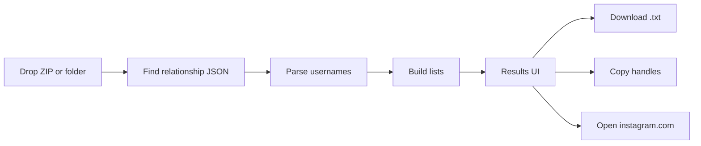

# Convert Instacheck from CLI to a browser-only web app

Instacheck is a single Python script ([nonfollowers.py](nonfollowers.py)) that diffs `following.json` vs `followers_*.json` from an official Instagram export. There is no backend, auth, or network today. The web version keeps that model: **files never leave the device**.

Keep the CLI. Add a static frontend that ports the parser to TypeScript.

## Architecture

- **No server, no uploads, no Instagram login.** Static host (GitHub Pages / Vercel / Netlify) is enough.
- Processing stays in-memory. Reload or leave the page and the data is gone.
- Large full-media exports are a risk if we inflate the whole ZIP. Only read entries whose names match relationship files (`following.json`, `followers*.json`, and the extra list files below). Prefer a "Followers and following" export, and also accept a dropped `followers_and_following` folder.

## Stack

Put the app in [`web/`](web/) so the Python CLI stays at the repo root.

- **Vite + React + TypeScript** — static build, good fit for search/filter/tabs
- **Tailwind + shadcn/ui** — upload zone, tabs, table, toasts
- **`@zip.js/zip.js`** — list ZIP entries and extract only the JSON we need
- **Vitest** — unit tests for the ported parser (the CLI has none today)

No Python web framework. The existing parser cannot be shared across languages; port it once and keep both implementations aligned.

## Port the parser

New module: [`web/src/lib/parse.ts`](web/src/lib/parse.ts), mirroring [nonfollowers.py](nonfollowers.py):

| Python | TypeScript |
|---|---|
| `_usernames_from_entries` | `usernamesFromEntries` |
| `_extract_relationship_list` | `extractRelationshipList` |
| `load_following` / `load_followers` | `loadFollowing` / `loadFollowers` |
| `not_following_back` | `notFollowingBack` |

Keep the same rules: `string_list_data[0].value` or last path segment of `href`, strip `@`, case-insensitive keys, first-seen display casing, merge all `followers*.json`.

Add a small ZIP/folder locator ([`web/src/lib/exportFiles.ts`](web/src/lib/exportFiles.ts)) that replaces `find_followers_and_following_dir`:

- Walk ZIP entry names or dropped File paths
- Accept export root, `connections/followers_and_following/`, or that folder itself
- If multiple `following.json` files are found, error (same as CLI)
- If only `following.html` / `followers*.html` exist, show the existing "request JSON, not HTML" message

## Extra lists (same export, same parser)

Instagram's `followers_and_following` folder usually includes more relationship JSON with the same `string_list_data` shape. Surface these as tabs once the files are present; hide a tab if the file is missing.

- **Not following back** — `following − followers` (current CLI)
- **Fans** — `followers − following` (inverse, free from the same files)
- **Pending requests** — `pending_follow_requests.json`
- **Recently unfollowed** — `recently_unfollowed_profiles.json`
- **Close friends** — `close_friends.json`
- **Blocked** — `blocked_profiles.json`

Do **not** add live Instagram profile checks. That needs unofficial network calls and breaks the offline/privacy story.

## UI

Single page, three states: empty / error / results.

**Empty (landing)**
- Short privacy line: export is parsed locally and never uploaded
- Condensed "how to download JSON" steps from [README.md](README.md)
- Drag-and-drop zone that accepts `.zip`, a folder, or the raw JSON files
- Optional handle field (labels + default download filename, same as `--handle`)

**Results**
- Summary chips: following count, followers count, not-following-back count
- Tabs for the lists above, each with a count
- Search box that filters the visible list
- Each row: username, link to `https://www.instagram.com/{username}/`, copy button
- Toolbar: copy all visible handles, download `{handle}-not-following-back.txt` (or the active tab’s list)
- Clear/reset to drop another export

**Errors** (reuse CLI wording)
- HTML export detected
- Missing `following.json` or `followers*.json`
- Invalid JSON
- Multiple `following.json` files

## CLI and docs

- Leave [`nonfollowers.py`](nonfollowers.py) and its flags unchanged
- Update [README.md](README.md): web app is the primary way to use it; CLI remains for local/offline terminal use
- Extend [`.gitignore`](.gitignore) for `web/node_modules`, `web/dist`

## Out of scope for v1

- User accounts, saved history, or a database
- Server-side processing
- Live active/deleted account checks
- Analyzing anyone else’s account
- Rewriting or removing the Python CLI
